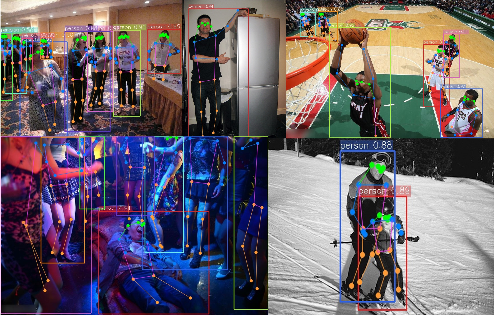

# EfficientGLS-Pose-s: An Efficient Generalized Landmark Segmentation Framework for Pose Detection

## Introduction
EfficientGLS-Pose-s is an advanced pose detection algorithm developed for high-accuracy and efficient human pose estimation tasks, tailored for both research and industrial applications. This repository contains the official implementation of our paper "[Title to be Updated]" (to be published), providing reproducible code, configuration files, and inference examples.

## Key Features
- **Novel Architecture**: Leverages a lightweight backbone combined with generalized landmark segmentation modules for superior accuracy-efficiency trade-off.
- **Flexible Configuration**: Customizable model configurations stored in `ultralytics/cfg/models/CustomCfg` for easy adaptation to various datasets and tasks.
- **Visualization Support**: Built-in result visualization with example output shown in `images/show-pose.jpg`.

## Installation
### Prerequisites
- Python ≥ 3.8
- PyTorch ≥ 2.0 (compatible with Ultralytics 8.3.3+ base environment)
- CUDA ≥ 11.7 (for GPU acceleration)

### Environment Setup
```bash
# Install Python packages using pip with Tsinghua mirror
pip install timm==1.0.7 thop efficientnet_pytorch==0.7.1 einops grad-cam==1.5.4 dill==0.3.8 albumentations==1.4.11 pytorch_wavelets==1.3.0 tidecv PyWavelets opencv-python -i https://pypi.tuna.tsinghua.edu.cn/simple

# Install and upgrade openmim
pip install -U openmim -i https://pypi.tuna.tsinghua.edu.cn/simple

# Install mmengine and mmcv using mim
mim install mmengine -i https://pypi.tuna.tsinghua.edu.cn/simple
mim install "mmcv>=2.0.0" -i https://pypi.tuna.tsinghua.edu.cn/simple
```

## Configuration Files
Model configurations for EfficientGLS-Pose-s are stored in the directory:
```
ultralytics/cfg/models/CustomCfg/
```
These files define network hyperparameters, loss functions, and training strategies. Modify them according to your specific dataset or task requirements.

## Inference Example
An example of the inference result is shown below:


*Figure 1: Sample output of EfficientGLS-Pose-b on a test image.*

## TODO List
- [ ] Detailed documentation for model customization

## Citation
If you find this work useful in your research, please consider citing our paper (BibTeX will be added after publication).

## Contact
For any questions or collaboration requests, please contact [Your Email] (to be updated).